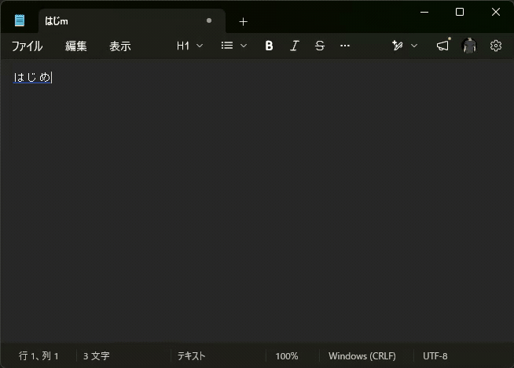
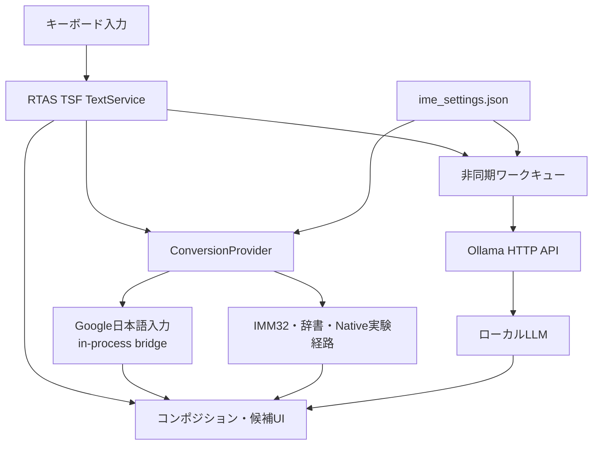

# RTAS

> ローカルAI翻訳を、日本語入力の候補選択へ統合したWindows向けIME

[](https://www.microsoft.com/windows)
[](https://isocpp.org/)
[](https://learn.microsoft.com/windows/win32/tsf/text-services-framework)
[](https://ollama.com/)

RTASは、かな漢字変換・日本語の言い換え・英訳を、ひとつの候補UIから操作できる
Windows向けの日本語入力システムです。

WindowsのIME互換APIから得たかな漢字変換結果と、Ollamaで実行するLLMの翻訳結果を組み合わせ、
文章を別のアプリへコピーせず、その場で英訳まで完了できる入力体験を目指しています。

> [!IMPORTANT]
> 現在は開発中のプロトタイプです。インストーラーは提供していないため、
> 利用にはソースからのビルドと、付属バッチまたは手動操作によるIME登録が必要です。

> [!WARNING]
> オリジナルのかな漢字変換を維持するため、既定設定は`transport=bridge`を使います。
> この経路はGoogle日本語入力の非公開・不安定な実装詳細に依存するため、
> Google日本語入力の更新で動作しなくなる可能性があります。製品利用や再配布を前提とせず、
> 応募用プロトタイプとして利用条件を独立して確認してください。

開発判断と生成AI支援の区分は[開発プロセス](DEVELOPMENT_PROCESS.md)、第三者要素と
再配布範囲は[NOTICE](NOTICE.md)および[第三者通知](THIRD_PARTY_NOTICES.md)に記載しています。

## デモ

「はじめまして」と入力し、かな漢字候補から翻訳レイヤーへ移動して、
ローカルLLMの`Nice to meet you.`を確定するまでの操作です。



## このプロジェクトで実現したこと

| 領域 | 実装内容 |
| --- | --- |
| Windows IME | TSF（Text Services Framework）を利用したネイティブIME |
| 日本語変換 | 既定はGoogle日本語入力互換ブリッジ、IMM32とOSS Mozc Nativeは実験経路 |
| AI支援 | Ollama上のローカルLLMによる言い換え・日英翻訳 |
| 候補UI | 日本語・言い換え・翻訳を切り替えられる3レイヤーUI |
| 応答性 | LLM処理をワーカースレッドへ分離し、入力UIの停止を回避 |
| 拡張性 | Mozc・IMM32・辞書・LLMを切り替えられるプロバイダー境界 |
| 堅牢性 | タイムアウト、キャンセル、候補キャッシュ、フォールバック挿入 |

## 入力体験

RTASでは、入力から翻訳までを次の3レイヤーで扱います。

| レイヤー | 役割 | 例 |
| --- | --- | --- |
| Layer 1 | かな漢字変換 | `nihon` → `日本` |
| Layer 2 | 日本語の言い換え・補完 | `日本` → 文脈に合う日本語候補 |
| Translation | 英訳 | 確定前の日本語 → 英語候補 |

候補を確定するまでは日本語のコンポジションを維持し、`SPACE`、`TAB`、
矢印キー、`ENTER`、`ESC`で各レイヤーを操作します。

## 主な特徴

### ローカルファースト

かな漢字変換にはローカルのGoogle日本語入力、翻訳には既定で`127.0.0.1`上のOllamaを使用します。
チェックイン済み設定のままなら入力内容をクラウド翻訳APIへ送りません。ただし
`IME3_OLLAMA_HOST`等で外部ホストへ変更できるため、その場合の送信先とデータ取扱いは
設定者が確認する必要があります。

### ネイティブなWindows入力統合

C++20で実装したTSF TextServiceとして動作します。コンポジション、候補表示、
入力モード、確定処理をWindowsの入力システムへ統合しています。

### UIを止めないLLM連携

OllamaへのHTTPリクエストは非同期キューで処理します。リクエストIDとキャンセルフラグで
古い応答を破棄し、タイムアウト中もIMEのキー入力を継続できる構成です。

### 交換可能な変換バックエンド

`ConversionProvider`を境界として、Mozc、IMM32、内蔵辞書、LLMを分離しています。
候補のスキーマを共通化し、UI側がバックエンドの詳細へ依存しない設計にしています。

## アーキテクチャ



通常のかな漢字変換では、RTAS DLLへ組み込んだbridge実装から
Google日本語入力のローカルセッション境界へ接続します。`mozc_bridge.exe`は、
同じ候補取得処理をRTAS本体から切り離して確認する診断用CLIであり、通常動作では起動しません。
bridgeは公開APIではないため、互換性・保守性・利用条件に注意が必要です。

## 技術スタック

- C++20
- Windows TSF / COM
- Win32 / IMM32
- WinHTTP
- Google日本語入力（Mozc系変換バックエンド）
- Ollama
- Visual Studio 2022 / MSBuild
- JSON設定

## 必要環境

### 実行環境

- Windows 10 / 11 x64
- [Google 日本語入力 Windows版](https://www.google.co.jp/ime/)
- [Ollama for Windows](https://docs.ollama.com/windows)
- Ollamaモデル用の空き容量
  - `gemma3:4b`の場合は約3.3 GB
- NVIDIAまたはAMD GPUを推奨

### ビルド環境

- Git
- Visual Studio Build Tools 2022
- MSVC v143 C++ x64/x86ビルドツール
- Windows 10 / 11 SDK
- IME登録時の管理者権限

## セットアップ

### バッチファイルによる最短セットアップ

Git、Visual Studio Build Tools 2022、Google日本語入力、Ollamaとモデルを準備した後は、
リポジトリ直下のバッチファイルでDebug x64版をビルド・登録できます。

1. `build_solution_debug_x64.bat`をダブルクリックします。
2. `[OK] Build succeeded.`と表示されたら、任意のキーでウィンドウを閉じます。
3. `install_rtas_x64.bat`をダブルクリックし、ユーザーアカウント制御を許可します。
4. `RTAS install completed.`と表示されたら、入力対象のアプリを再起動します。
5. `Win + Space`から`RTAS`を選択し、動作を確認します。

`install_rtas_x64.bat`は`x64\Debug\Ime3.dll`を登録し、
`config\ime_settings.json`を`x64\Debug\config`へコピーします。ビルドは行わないため、
初回およびソース変更後は必ず`build_solution_debug_x64.bat`を先に実行してください。

アンインストールするときは、入力対象のアプリを閉じてから
`uninstall_rtas_x64.bat`をダブルクリックし、ユーザーアカウント制御を許可します。
登録したDLLが必要になるため、アンインストール前にリポジトリや`x64\Debug`を削除しないでください。

以下は、各処理を確認しながらRelease x64版を手動でビルド・登録する手順です。

### 1. リポジトリを取得

```powershell
git clone https://github.com/maaakigai/rtas-local-ai-translation-ime.git
Set-Location rtas-local-ai-translation-ime
```

### 2. ビルドツールを準備

Visual Studio 2022 Build Toolsをwingetで導入する場合は、PowerShellで次を実行します。

```powershell
winget install --id Microsoft.VisualStudio.2022.BuildTools --exact --source winget `
  --accept-source-agreements --accept-package-agreements `
  --override "--wait --passive --norestart --add Microsoft.VisualStudio.Workload.VCTools --includeRecommended"
```

### 3. Google日本語入力を準備

[Google 日本語入力](https://www.google.co.jp/ime/)をインストールし、単体で日本語変換が
できることを確認します。既定の`transport=bridge`は、Google日本語入力のローカル変換処理を
RTAS DLL内のbridge実装から呼び出します。Windows標準のMicrosoft IMEだけでは動作しません。

### 4. Ollamaとモデルを準備

```powershell
winget install --id Ollama.Ollama --exact --source winget `
  --accept-source-agreements --accept-package-agreements

ollama pull gemma3:4b
ollama cp gemma3:4b default
```

設定中の`default`はOllamaの予約語ではなく、ローカルに作成するモデルエイリアスです。
上の例では`gemma3:4b`を`default`という名前で参照できるようにしています。
これにより、RTASの設定を変更せず、Ollama側で実モデルを差し替えられます。

OllamaのAPIと、`default`エイリアスが作成されたことを確認します。

```powershell
Invoke-RestMethod http://127.0.0.1:11434/api/version
ollama list
```

一覧に`default:latest`が表示されれば、既定モデルの準備は完了です。

### 5. Release x64をビルド

```powershell
$msbuild = "C:\Program Files (x86)\Microsoft Visual Studio\2022\BuildTools\MSBuild\Current\Bin\amd64\MSBuild.exe"

& $msbuild Ime3.sln /t:Build /m:1 `
  /p:Configuration=Release `
  /p:Platform=x64 `
  /p:CLToolAdditionalOptions="/FS"
```

主な成果物は`x64\Release`に出力されます。

| ファイル | 役割 |
| --- | --- |
| `Ime3.dll` | TSF IME本体 |
| `Imm32Ime.dll` | IMM32互換実装 |
| `ImmInstall.exe` | IMM32登録補助 |
| `mozc_bridge.exe` | 非公開セッション境界を調べる実験用CLI（既定では未使用） |

### 6. 実行時設定を配置

```powershell
New-Item -ItemType Directory -Path .\x64\Release\config -Force | Out-Null
Copy-Item .\config\ime_settings.json .\x64\Release\config\ime_settings.json -Force
```

リポジトリ直下の`config\ime_settings.json`は配布元の設定です。
実行時にRTASが読み込むのは、DLLと同じ出力ツリーへ配置した
`x64\Release\config\ime_settings.json`です。元設定を変更した場合は、上のコピーを再実行してください。

### 7. RTASを登録

PowerShellを管理者として開き、次を実行します。

```powershell
$dll = (Resolve-Path .\x64\Release\Ime3.dll).Path
Start-Process regsvr32.exe -ArgumentList "`"$dll`"" -Wait
```

入力対象のアプリを再起動し、`Win + Space`から`RTAS`を選択します。

### 8. 動作を確認

1. Notepadなどのテキスト入力アプリを起動します。
2. `Win + Space`で`RTAS`を選択します。
3. `半角/全角`を押し、入力モードを`あ`にします。
4. `nihon`と入力して`SPACE`を押します。
5. `日本`などのかな漢字候補が表示されることを確認します。
6. 候補レイヤーを移動し、言い換え・英訳候補を確認します。

## キー操作

| キー | 動作 |
| --- | --- |
| `半角/全角` | `A`（英数）と`あ`（かな）を切り替え |
| `Shift + 半角/全角` | 通常モードとかな漢字変換専用モードを切り替え |
| `SPACE` | 候補の巡回、または次の候補レイヤーへ移動 |
| `Shift + SPACE` | 言い換え・翻訳候補を再問い合わせ |
| `TAB` / 矢印キー | 候補タブや選択候補を移動 |
| `Ctrl + TAB` | 候補レイヤーを切り替え |
| `ENTER` | 選択中の候補を確定 |
| `ESC` | 現在の候補レイヤーを閉じる、または処理をキャンセル |

## 設定

配布元の設定ファイルは[`config/ime_settings.json`](config/ime_settings.json)です。
Releaseビルドの実行時には`x64\Release\config\ime_settings.json`を読み込みます。

主要な既定値は次のとおりです。

```text
provider.kana.mode                         = "mozc"
provider.kana.mozc.transport               = "bridge"
provider.kana.mozc.kana_kanji_only_mode    = false
provider.translation.mode                  = "llm"
provider.translation.llm.model             = "default"
provider.translation.llm.timeout_ms        = 3000
provider.translation.llm.warmup_on_activate = true
```

### Ollamaモデルを変更する

#### 推奨：`default`エイリアスの実体を変更する

別のモデルを使う場合は、そのモデルを取得して`default`エイリアスを作成します。
RTASの設定変更や再ビルドは不要です。

```powershell
ollama pull llama3.1
ollama cp llama3.1 default
ollama list
```

変更後は入力対象のアプリでRTASをいったん無効化し、再度有効化してください。
利用中だったモデルは無効化から10秒後に解放され、再有効化時に新しいモデルが読み込まれます。

#### 設定ファイルでモデル名を直接指定する

`x64\Release\config\ime_settings.json`の
`provider.translation.llm.model`を、Ollamaに登録されているモデル名へ変更します。

```json
{
  "provider": {
    "translation": {
      "llm": {
        "model": "llama3.1"
      }
    }
  }
}
```

リポジトリ直下の`config\ime_settings.json`を編集した場合は、
「実行時設定を配置」のコピーコマンドを再実行してください。

#### 環境変数で一時的に上書きする

環境変数は設定ファイルより優先されます。次の例では、そのPowerShellから起動した
Notepad上のRTASだけが`llama3.1`を使用します。

```powershell
$env:IME3_OLLAMA_MODEL = "llama3.1"
Start-Process notepad.exe
```

環境変数`IME3_OLLAMA_MODEL`、`IME3_OLLAMA_HOST`、`IME3_OLLAMA_PORT`を設定すると、
モデルとOllamaの接続先を上書きできます。すでに起動しているアプリには反映されないため、
設定後に入力対象のアプリを再起動してください。

Docker版Ollamaも同じHTTP APIで利用できます。Windows版と同時に起動する場合は、
ホストポートが競合しないように設定してください。

## トラブルシューティング

### `Win + Space`にRTASが表示されない

- 管理者PowerShellで`Ime3.dll`を登録したか確認します。
- 登録後にNotepadなどの入力対象アプリを再起動します。
- 現在の主対象はx64アプリです。まずWindows標準のx64版Notepadで確認してください。

### かな漢字候補が表示されない

- Windowsの設定で日本語IMEが追加され、単体で変換できることを確認します。
- Google日本語入力がインストールされ、単体で変換できることを確認します。
- `provider.kana.mozc.transport`が既定の`bridge`になっていることを確認します。
- 設定変更後は入力対象のアプリを再起動します。

### 言い換え・英訳候補が表示されない

```powershell
Invoke-RestMethod http://127.0.0.1:11434/api/version
ollama list
```

- Ollamaが起動していることを確認します。
- `ollama list`に、設定したモデルまたは`default:latest`があることを確認します。
- `Shift + 半角/全角`でかな漢字変換専用モードになっていないことを確認します。
- `provider.translation.mode`が`llm`になっていることを確認します。

### 設定変更が反映されない

- RTASが読むのは`x64\Release\config\ime_settings.json`です。
- 環境変数`IME3_OLLAMA_MODEL`が残っていると、設定ファイルのモデル名より優先されます。
- 設定変更後に入力対象のアプリを再起動します。

### 初回のAI候補だけ時間がかかる

初回はOllamaがモデルをメモリへ読み込むため時間がかかる場合があります。
RTASは有効化時にモデルをウォームアップし、無効化から10秒後に解放します。

## テスト

単体テストは設定の読み込み、辞書ローダー、変換プロバイダー、
ユーザー学習ストアなどを対象にしています。

```powershell
& $msbuild tests\unit\Ime3Tests.vcxproj /t:Build `
  /p:Configuration=Release `
  /p:Platform=x64

.\tests\unit\x64\Release\Ime3Tests.exe
```

IME固有の操作やOllama障害時の挙動は、[`tests/manual`](tests/manual)の
手動テスト手順で確認できます。

2026-07-25の応募用スナップショット監査では、`Release|x64`のソリューションと
単体テストプロジェクトを再ビルドし、警告0・エラー0、`Ime3Tests.exe`終了コード0を確認しました。
この自動確認には、全アプリ上のTSF操作、実Ollamaモデル、Google日本語入力の各バージョンとの
統合動作は含まれません。

## ディレクトリ構成

```text
RTAS
├─ build_solution_debug_x64.bat   Debug x64ワンクリックビルド
├─ install_rtas_x64.bat           Debug x64登録・実行時設定配置
├─ uninstall_rtas_x64.bat         Debug x64登録解除
├─ Ime3/                 TSF TextService、候補UI、登録処理
├─ Imm32Ime/             IMM32互換実装
├─ ImmInstall/           IMM32登録補助ツール
├─ src/
│  ├─ api/               変換プロバイダーの共通API
│  ├─ config/            JSON設定の読み込み
│  ├─ dictionary/        辞書ローダー
│  ├─ llm/               Ollamaクライアントと応答パーサー
│  ├─ provider/          Mozc・IMM32・辞書プロバイダー
│  └─ user_learn/        ユーザー学習データ
├─ tests/                単体テスト、手動テスト、サンプルデータ
├─ tools/                診断・辞書生成・比較ツール
├─ config/               実行時設定
└─ docs/                 設計資料と運用手順
```

## 実装上のポイント

- TSF EditSessionを使ったコンポジションの開始・更新・確定
- TSFの入力モードCompartmentsと物理トグルキーの同期
- 1ワーカーの非同期キューによるLLM問い合わせの直列化
- キャンセル済み・期限切れリクエストのUI反映防止
- LRU相当の上限付きメモリキャッシュによる候補再利用
- EditSession失敗時の`SendInput`フォールバック
- JSON設定によるプロバイダー、モデル、タイムアウトの切り替え
- Mozc接続方式を比較できる診断・スモークテスト用ツール

## 現在の制約

- Windows x64を主な対象としています。
- インストーラーと自動更新機能は未実装です。
- Google日本語入力とOllamaの事前インストールが必要です。
- 初回翻訳はモデルのロードにより時間がかかる場合があります。
- 既定のbridge経路はGoogle日本語入力の非公開セッション境界に依存します。
- IMM32経路とMozcネイティブバックエンドは調査・検証段階です。
- `Ime3/rtas_text_service.h`にはまだ複数の責務が集中しており、候補状態、キー処理、
  非同期連携を段階的に分割する余地があります。

## アンインストール

Debug x64版を`install_rtas_x64.bat`で登録した場合は、入力対象のアプリを閉じてから
`uninstall_rtas_x64.bat`をダブルクリックするのが最短です。

Release x64版を手動登録した場合は、次の手順で登録を解除します。

PowerShellを管理者として開き、登録時に使用したDLLを解除します。

```powershell
$dll = (Resolve-Path .\x64\Release\Ime3.dll).Path
Start-Process regsvr32.exe -ArgumentList "/u `"$dll`"" -Wait
```

その後、入力対象のアプリを再起動してください。

## 関連ドキュメント

- [開発プロセスとAI支援](DEVELOPMENT_PROCESS.md)
- [公開範囲と注意事項](NOTICE.md)
- [第三者通知](THIRD_PARTY_NOTICES.md)
- [入力・候補選択フロー](docs/state_machine.md)
- [候補スキーマ](docs/api/candidate_schema.md)
- [変換プロバイダーAPI](docs/api/conversion_provider.md)
- [プロバイダー切り替え](docs/operations/provider_switch.md)
- [テスト計画](docs/operations/v1_0_test_plan.md)
- [Mozc接続の設計調査](docs/dictionary/mozc_native_design_investigation.md)

## ライセンス

作者のコードと文書は、応募・評価のため閲覧可能にしていますが、再利用許諾はしていません。
詳細は[`LICENSE`](LICENSE)を参照してください。第三者要素にはそれぞれの条件が適用されます。
