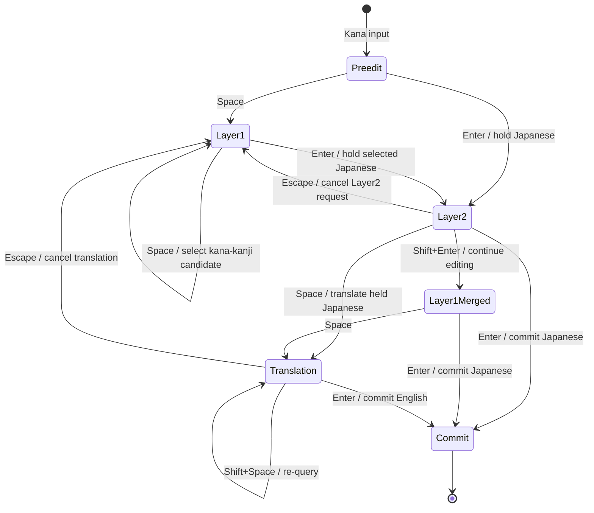

# 入力・候補選択フロー

2026-09-07: Layer1 の Enter で Layer2 へ進む現在の操作を維持する。
Layer1 はかな漢字変換、Layer2 は変換済み日本語を翻訳用の文章として未確定で保持する。
既定の Mozc プロバイダーでは Layer2 でかな漢字変換をやり直さない。

## 操作上の契約

| 状態 | キー | 結果 |
| --- | --- | --- |
| 入力中／通常の Layer1 | Enter | 選択した日本語を Layer2 へ渡す。文書へはまだ確定しない |
| Layer2 | Space | 保持している日本語から翻訳を開始（翻訳が利用可能な場合） |
| Layer2 | Enter | 保持している日本語を確定 |
| Layer2 | Shift+Enter | Layer1 へ戻して継続編集 |
| Layer2 | Shift+Space | Layer2 の候補を再取得 |
| Layer1 に戻した編集結果 | Enter | 日本語を確定 |
| Translation | Space | 取得済み翻訳候補を巡回 |
| Translation | Shift+Space | 翻訳を再問い合わせ |
| Translation | Enter | 翻訳候補を確定 |
| Translation | Escape | リクエストを無効化し、Layer1 へ戻る |
| Layer2 | Escape | リクエストを無効化し、Layer1 へ戻る |

かな漢字変換専用モード、または Layer2 非対応のプロバイダーでは、Layer1 の Enter で日本語を確定する。
入力中の Enter は TextService のキー処理から Layer2 へ進む。候補 UI が開いているときの Enter の判断は LayerState が担当する。
Layer2 で翻訳が利用できない場合、Space は取得済みの日本語候補を巡回する。
Layer1 の Escape は現在の composition と候補 UI を閉じる。

## 実装境界と検証

- `Ime3/rtas_layer_state.h`: 選択レイヤー、継続編集の状態、Enter の操作判断。
- `Ime3/rtas_text_service.h`: 判断に従って TSF のプレビュー・確定・候補表示を実行する。
- `Ime3/rtas_candidate_request.h`: レイヤーごとに一つの有効な非同期リクエストを管理する。
- `tests/unit/candidate_state_tests.cpp`: Enter の判断、既定プロバイダーの日本語保持、遅延応答拒否を検証する。

翻訳の文書への反映は既定で replace。TSF や SendInput の互換処理は維持する。
