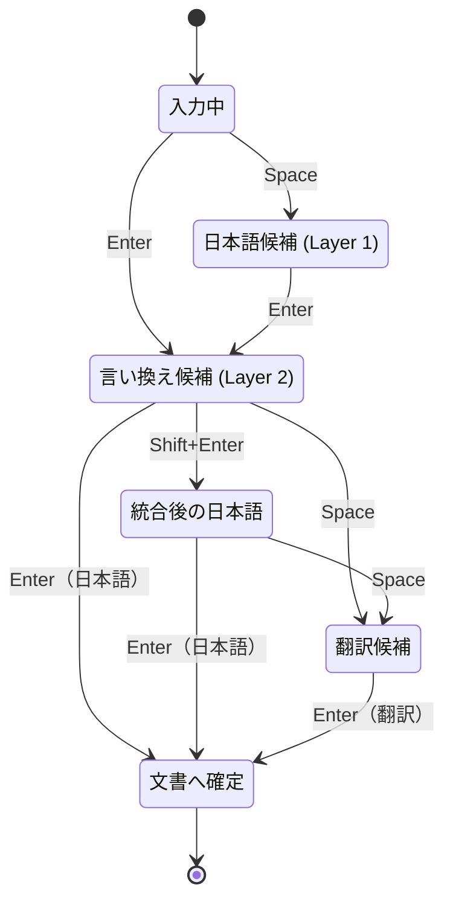

# 入力・候補選択フロー

次の図は、既定構成で利用者に見える主要な操作経路を示す概念図です。
候補の巡回、再問い合わせ、非同期処理などの詳細は図から省略しています。

図ではLayer 2と言い換え後の日本語を利用できる既定経路を示しています。
選択したプロバイダーがLayer 2または翻訳に対応しない場合、その段階は省略されます。

## 主なキー操作

| 状態 | キー | 動作 |
| --- | --- | --- |
| 入力中 | Space | 日本語候補を開く |
| 入力中／Layer 1 | Enter | Layer 2へ進む。Layer 2非対応時は日本語を確定する |
| Layer 1 | Space | 日本語候補を順に選択する |
| Layer 2 | Space | 選択中の言い換えを翻訳へ渡す。翻訳非対応時は言い換え候補を順に選択する |
| Layer 2 | Shift+Space | 言い換え候補を再問い合わせする |
| Layer 2 | Enter | 選択中の言い換えを日本語として確定する |
| Layer 2 | Shift+Enter | 選択中の言い換えを日本語へ統合し、編集を続ける |
| 統合後の日本語 | Space／Enter | 翻訳へ進む／日本語として確定する |
| 翻訳 | Space／Shift+Space／Enter | キャッシュ済み候補を順に選択する／再問い合わせする／翻訳文を確定する |
| 候補表示中 | Escape | Layer 2・翻訳からLayer 1へ戻る。Layer 1では変換中の文字列を取り消す |

## 実装との対応

- `CandidateTab`は`Layer1`、`Layer2`、`Translation`の3種類です。
- 「統合後の日本語」は、Layer 2の選択結果をLayer 1へ戻した`m_layer1Merged`状態です。
- 「入力中」と「文書へ確定」は、専用の`CandidateTab`ではなく、候補UIやcompositionの有無を含めた概念上の段階です。
- Layer 2と翻訳の問い合わせは非同期です。処理中は候補UIに待機状態を表示し、完了したrequest IDに対応する結果だけを反映します。
