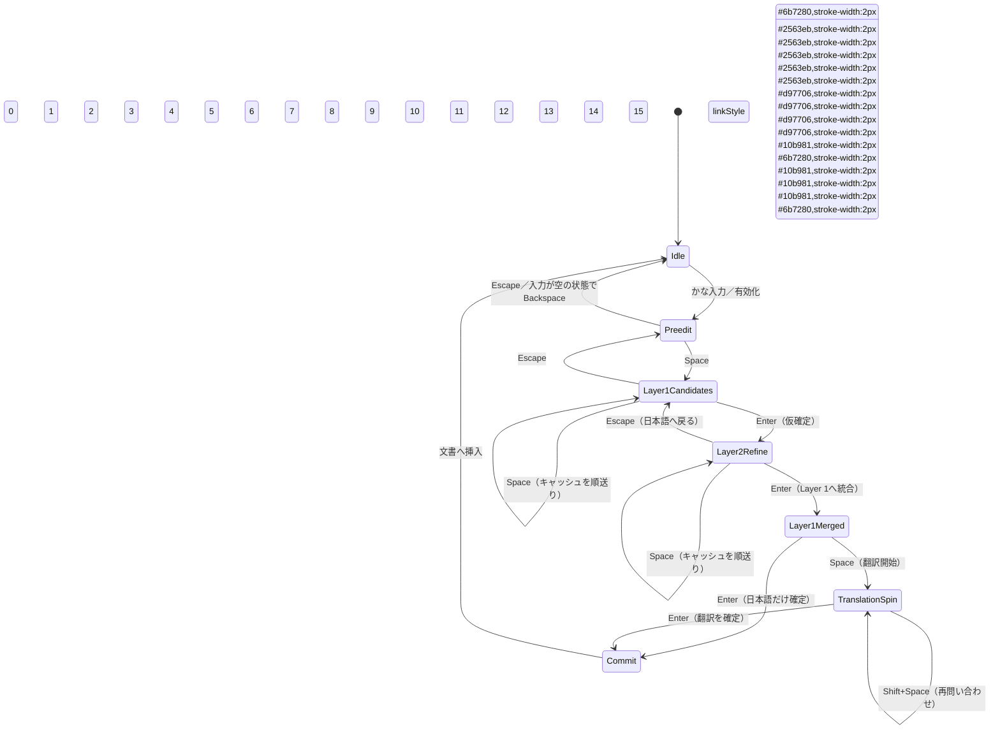

# 多層状態機械

## レイヤーの定義

- **Preedit**：`m_romajiBuffer + m_reading`。overlayにかな入力状態を表示します。
- **Layer1Candidates**：かな漢字変換プロバイダーが返す日本語候補です。
- **Layer2Refine**：辞書／LLMによる言い換え・拡張候補です。
- **Layer1Merged**：言い換えを戻して統合した、未確定の日本語文です。
- **TranslationSpin**：確認済みの日本語文だけを使うLLM翻訳要求です。
- **Commit**：最終挿入段階です。既定では翻訳文が日本語文を置換します。

## 非同期イベント

Layer2RefineとTranslationSpinは`QueueTranslationAsync`または将来のプロバイダーを利用します。処理中はrequest ID付きの`pending=true`を返し、完了後に`OnTranslationReady`が`PreviewCandidateString`へ結果を渡します。

## 主なキー操作

| キー | 状態 | 動作 |
| --- | --- | --- |
| Space | Preedit | Layer 1候補を開く |
| Enter | Layer 1 | 仮確定してLayer 2へ移る |
| Space | Layer 2 | キャッシュ済み言い換えを順に表示する |
| Shift+Space | Layer 2 | 新しい言い換えを問い合わせる |
| Enter | Layer 2 | 選択内容をLayer 1へ統合する |
| Space | Layer1Merged | 翻訳レイヤーを開く（まずキャッシュを利用） |
| Shift+Space | Translation | 翻訳を再問い合わせする |
| Enter | Translation | 日本語文を翻訳文へ置換する（既定） |
| Enter | Layer1Merged | 翻訳せず日本語文を確定する |
| Escape | 任意 | Translation → Layer1Merged → Layer 1 → Preedit → Idleの順に1段階戻る |

> 追記方式は設定から利用できますが、既定は置換です。プロバイダーは希望する確定方式をmetadataへ含めます。
