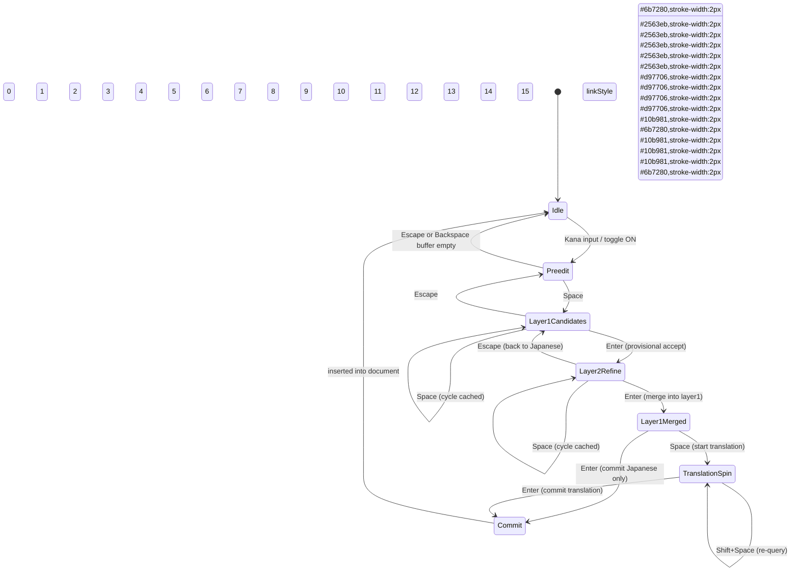

# Multi-layer state machine

## Layer definitions
- **Preedit**: `m_romajiBuffer + m_reading`; overlay shows kana status.
- **Layer1Candidates**: Japanese candidates from the dictionary/IMM32 provider.
- **Layer2Refine**: paraphrase/extension suggestions (dictionary + LLM hybrid).
- **Layer1Merged**: paraphrase merged back, still uncommitted.
- **TranslationSpin**: translation request to LLM using the confirmed Japanese text only.
- **Commit**: final insertion stage; translation replaces Japanese by default.

## Async events
Layer2Refine and TranslationSpin rely on `QueueTranslationAsync` (or future providers). They return `pending=true` with a request id, and `OnTranslationReady` feeds `PreviewCandidateString` once results arrive.

## Key triggers (summary)
| Key | Stage | Effect |
| --- | --- | --- |
| Space | Preedit | Open layer1 candidates |
| Enter | Layer1 | Move to layer2 (provisional accept) |
| Space | Layer2 | Cycle cached paraphrases |
| Shift+Space | Layer2 | Request new paraphrases |
| Enter | Layer2 | Merge selection into layer1 |
| Space | Layer1Merged | Open translation layer (cached first) |
| Shift+Space | Translation | Re-query translation |
| Enter | Translation | Replace Japanese sentence with translation (default) |
| Enter | Layer1Merged | Commit Japanese without translation |
| Escape | any | Step back one layer (Translation → Layer1Merged → Layer1 → Preedit → Idle) |

> Note: Append mode remains available via settings but defaults to replace; providers carry the desired commit mode in metadata.
